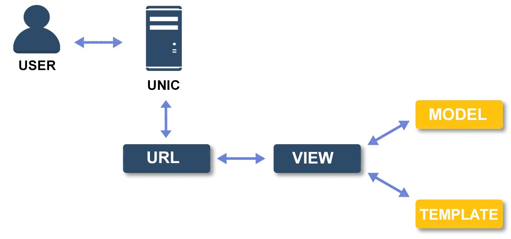

## Introduction

### What is unic framework

<p align="center">
  
</p>

Unic is a high performance, open source web application framework.
Unic web framework follows the MVT (Model-View-Template) architectural pattern.

### Why unic framework

Unic is fast and lightweight php web framework. Unic framework is very simple and easy to learn, even if you are new in web development don't worry you will love this framework.

  - Fast and Powerful.
  - Extremely Light Weight.
  - MVT Architecture.
  - Security and XSS Filtering.
  - Simple and Easy to learn.
  - Easy to Deploy on any server.

### Unic architecture

<p align="center">
  <br/>
  
  <br/>
</p>

Unic web framework based on MVT (Model-View-Template) architecture. The MVT (Model-View-Template) is a software design pattern. The Model helps to handle database. It is a data access layer which handles the database.
The Template is a presentation layer which handles User Interface part. The View is used to execute the business logic and interact with a model to carry data and renders a template.


### Directory Structure of Unic

Unic web framework has very simple and clean directory structure.

```
unic
├── application
│   ├── app
│   │   ├── model.php
│   │   ├── static
│   │   ├── template
│   │   ├── urls.php
│   │   └── view.php
│   ├── settings.php
│   └── urls.php
├── system
├── composer.json
├── .htaccess
└── index.php
```

Unic framework allows users to create their own directory structure.

#### System directory
  system directory is main system directory of unic framework, where all the system files are stored.

#### Application directory
  application is main project directory that contains all your apps and project files (urls, view, model, etc)

#### App directory
  app is demo application of your project. your can create new apps like login, admin, news, blogs or any app that you want. your app directory contains view, model and urls files.

#### Templates directory
  templates directory contains all your HTML template files.
